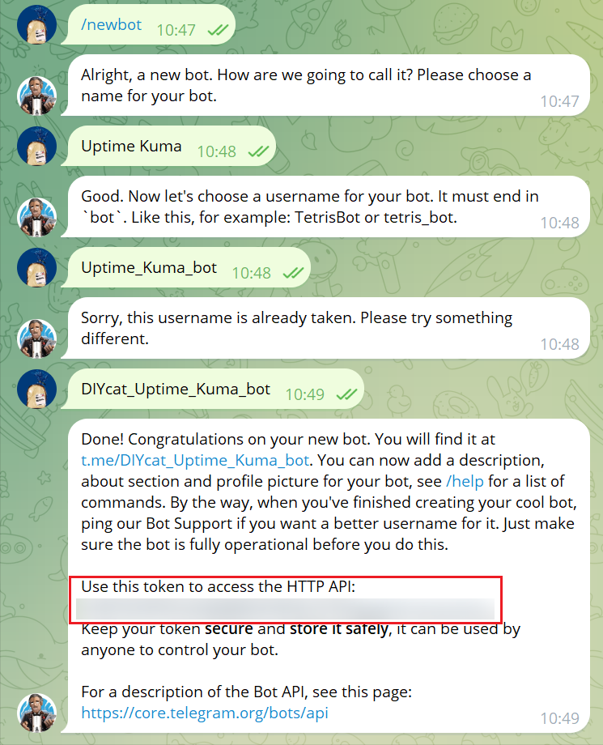

## Preparation

- Telegram Bot Token
- Cloudflare account

### Telegram Bot Token

You can obtain the token from [BotFather](https://t.me/BotFather)



### Cloudflare Workers

Create a new worker and enter a name and the following `worker.js` content:

```js
const whitelist = ["/botxxxxxxxxxx:"];
const tg_host = "api.telegram.org";

addEventListener("fetch", (event) => {
  event.respondWith(handleRequest(event.request));
});

function validate(path) {
  for (var i = 0; i < whitelist.length; i++) {
    if (path.startsWith(whitelist[i])) return true;
  }
  return false;
}

async function handleRequest(request) {
  var u = new URL(request.url);
  u.host = tg_host;
  if (!validate(u.pathname))
    return new Response("Unauthorized", {
      status: 403,
    });
  var req = new Request(u, {
    method: request.method,
    headers: request.headers,
    body: request.body,
  });
  const result = await fetch(req);
  return result;
}
```

- Replace `"/botxxxxxxxxxx:"` with the numerical part of your `Telegram Bot Token`, then save and deploy.
- You can also customize the domain. If you encounter a `403` error, you can try opening the Cloudflare IP whitelist.
