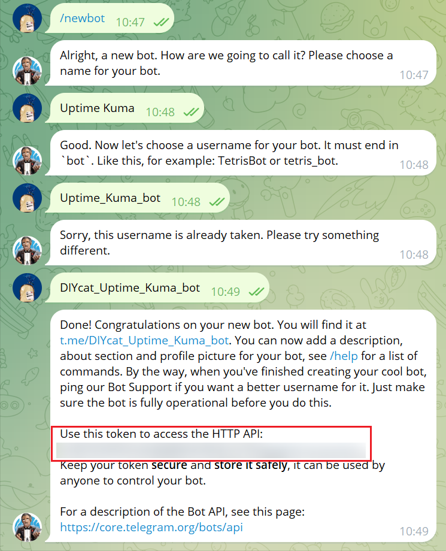

## 准备内容

- Telegram Bot Token
- Cloudflare 帐户

### Telegram Bot Token

可以从 [BotFather](https://t.me/BotFather) 获取 Token。



### Cloudflare Workers

首先创建一个 `Worker` ，然后输入名称和以下 `worker.js` 内容：

```js
const whitelist = ["/botxxxxxxxxxx:"];
const tg_host = "api.telegram.org";

addEventListener("fetch", (event) => {
  event.respondWith(handleRequest(event.request));
});

function validate(path) {
  for (var i = 0; i < whitelist.length; i++) {
    if (path.startsWith(whitelist[i])) return true;
  }
  return false;
}

async function handleRequest(request) {
  var u = new URL(request.url);
  u.host = tg_host;
  if (!validate(u.pathname))
    return new Response("Unauthorized", {
      status: 403,
    });
  var req = new Request(u, {
    method: request.method,
    headers: request.headers,
    body: request.body,
  });
  const result = await fetch(req);
  return result;
}
```

- 将 `"/botxxxxxxxxxx:"` 替换为 `Telegram Bot Token` 的前面数字部分，然后保存并部署。
- 还可以自定义域名。如果出现 `403` 错误，可以尝试开放 Cloudflare IP 白名单。
